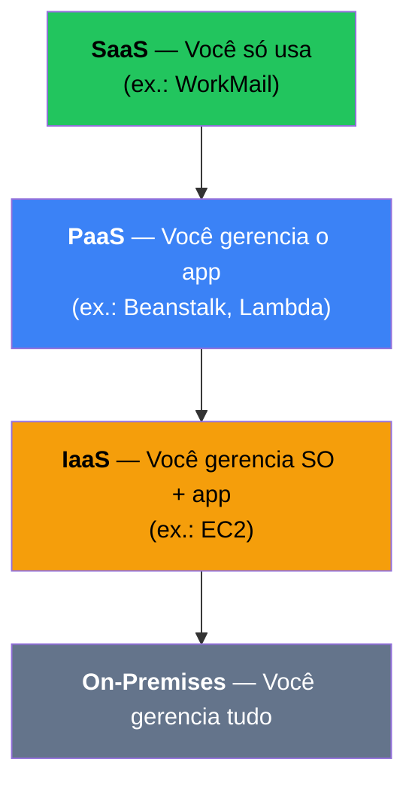

# 1.3 — Modelos de Serviço: IaaS, PaaS, SaaS

## Pirâmide de Responsabilidade

> ⬆️ **Mais alto = menos responsabilidade operacional sua.**

---

## IaaS — Infrastructure as a Service

- **Você controla**: SO, middleware, runtime, aplicação, dados.
- **AWS fornece**: hardware, virtualização, rede, armazenamento.
- **Exemplos AWS**: **EC2**, EBS, VPC.

## PaaS — Platform as a Service

- **Você controla**: apenas o código e os dados.
- **AWS fornece**: SO, runtime, patches, escala.
- **Exemplos AWS**: **Elastic Beanstalk**, Lambda, RDS (gerenciado).

## SaaS — Software as a Service

- **Você controla**: apenas sua configuração e usuários.
- **AWS/Fornecedor fornece**: tudo o resto.
- **Exemplos AWS**: **Amazon WorkMail**, Amazon Chime, Amazon Connect.

---

## Comparação Rápida

| Modelo | Controle | Manutenção | Exemplo |
|--------|----------|------------|---------|
| IaaS | Alto | Alta | EC2 |
| PaaS | Médio | Média | Beanstalk |
| SaaS | Baixo | Baixa | WorkMail |

---

## Pontos-Chave para o Exame

- ✅ **EC2 = IaaS**, **Beanstalk = PaaS**, **WorkMail = SaaS**.
- ✅ Lambda é frequentemente classificado como **PaaS** (ou FaaS).
- ✅ Quanto **mais alto na pirâmide**, menos responsabilidade operacional.

---

[← Aula anterior](./1.2-beneficios-da-nuvem.md) | [Próxima aula → 1.4 Modelos de Implantação](./1.4-modelos-de-implantacao.md)
