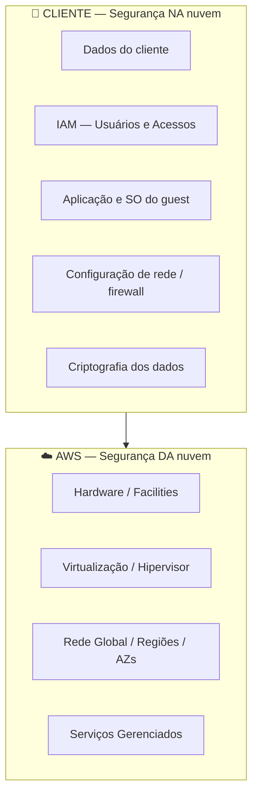

# 2.1 — Modelo de Responsabilidade Compartilhada

> **Tópico mais cobrado do Domínio 2.** Memorize quem é responsável pelo quê.

---

## A Regra de Ouro

| Parte | Responsabilidade |
|-------|------------------|
| **AWS** | Segurança **DA** nuvem (infraestrutura) |
| **Cliente** | Segurança **NA** nuvem (seus dados e configurações) |

---

## Responsabilidades da AWS

- Hardware (servidores, storage, rede)
- Instalações físicas (data centers)
- Virtualização (hipervisor)
- Rede global (Regiões, AZs, Edge)
- Patches do hardware e dos serviços gerenciados

## Responsabilidades do Cliente

- Dados do cliente
- Gerenciamento de identidade e acesso (**IAM**)
- Sistema operacional (em EC2) — patches, hardening
- Configuração de rede (SG, NACL)
- Criptografia dos dados (em trânsito e repouso)
- Aplicação e suas dependências

---

## Responsabilidade Varia por Tipo de Serviço

| Tipo | Exemplo | Patches do SO? |
|------|---------|----------------|
| **IaaS** | EC2 | **Cliente** |
| **PaaS** | RDS, Beanstalk | **AWS** |
| **SaaS** | WorkMail | **AWS** |

---

## Exemplos Práticos

| Item | Quem é responsável? |
|------|--------------------|
| Patch do hipervisor EC2 | **AWS** |
| Patch do Windows/Linux em uma instância EC2 | **Cliente** |
| Patch do engine MySQL no RDS | **AWS** |
| Configuração do Security Group | **Cliente** |
| Segurança física do data center | **AWS** |
| Criptografar buckets S3 | **Cliente** |
| Disponibilidade da API do S3 | **AWS** |

---

## Pontos-Chave para o Exame

- ✅ AWS = "**DA** nuvem"; Cliente = "**NA** nuvem".
- ✅ Em **EC2**, patches do SO são do **cliente**.
- ✅ Em **RDS**, patches do SO e engine são da **AWS**.
- ✅ **IAM sempre é do cliente**.
- ✅ **Criptografia dos dados** sempre é do cliente (mesmo quando a AWS fornece a ferramenta).

---

[← Voltar ao módulo](./README.md) | [Próxima aula → 2.2 IAM](./2.2-iam.md)
