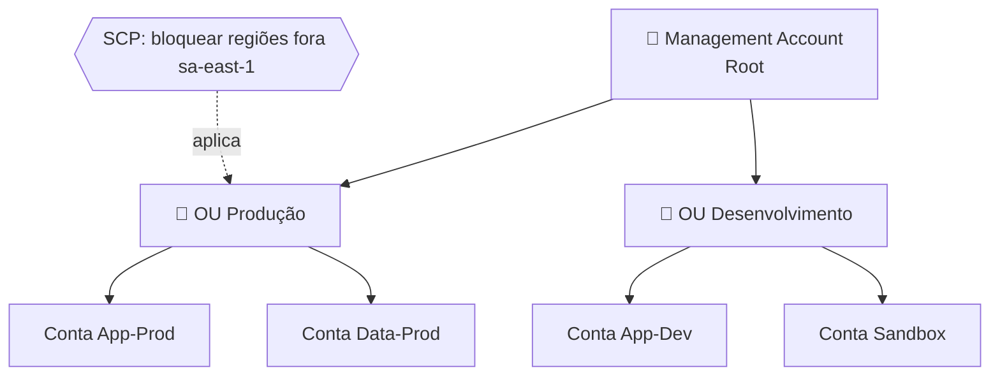

# 2.3 — AWS Organizations e Control Tower

## AWS Organizations

Gerencia **múltiplas contas AWS** de forma centralizada.

### Benefícios
- **Consolidated Billing** — uma fatura para todas as contas.
- **Descontos por volume** agregados.
- **SCPs (Service Control Policies)** — limitam o que contas-filho podem fazer.
- Criação programática de contas.
- **OUs (Organizational Units)** — agrupam contas por área (Dev, Prod, Finance).

### Estrutura

### SCPs
- São **guardrails** — não concedem permissão, apenas **limitam**.
- Aplicadas a OUs ou contas individuais.
- Exemplo: "Nenhuma conta pode usar regiões fora de `sa-east-1`".

---

## AWS Control Tower

- **Configuração automatizada** de um ambiente **Landing Zone** multi-conta.
- Aplica **guardrails** (preventivos e detectivos) via SCPs e Config Rules.
- Dashboard central de conformidade.
- Usa **Organizations + IAM Identity Center + Config + CloudTrail** por baixo.

### Quando usar?
- Novas organizações que precisam de **múltiplas contas** com governança desde o início.

---

## Comparação

| Recurso | Organizations | Control Tower |
|---------|---------------|---------------|
| Criar contas | ✅ | ✅ (automatizado) |
| Consolidated Billing | ✅ | ✅ |
| SCPs | ✅ (manual) | ✅ (prontos) |
| Landing Zone | ❌ | ✅ |
| Dashboard de conformidade | ❌ | ✅ |

---

## Pontos-Chave para o Exame

- ✅ **Organizations** habilita **Consolidated Billing** e **SCPs**.
- ✅ **SCP** limita, nunca concede permissão.
- ✅ **Control Tower** = Organizations + automação + guardrails.
- ✅ Uma conta só pode estar em **uma** organização.

## Documentação Oficial (pt-BR)

- [AWS Organizations](https://docs.aws.amazon.com/pt_br/organizations/latest/userguide/orgs_introduction.html)
- [Service Control Policies (SCPs)](https://docs.aws.amazon.com/pt_br/organizations/latest/userguide/orgs_manage_policies_scps.html)
- [AWS Control Tower](https://docs.aws.amazon.com/pt_br/controltower/latest/userguide/what-is-control-tower.html)
- [Consolidated Billing](https://docs.aws.amazon.com/pt_br/awsaccountbilling/latest/aboutv2/consolidated-billing.html)

---

[← Aula anterior](./2.2-iam.md) | [Próxima aula → 2.4 Criptografia](./2.4-criptografia.md)
