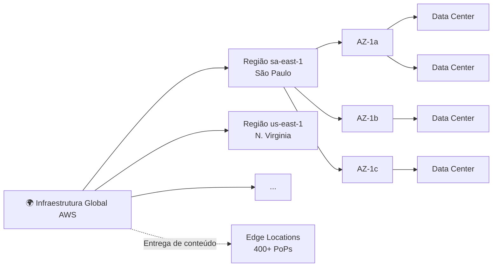

# 3.1 — Infraestrutura Global AWS

## Hierarquia

---

## Regiões AWS

- **Localizações geográficas** no mundo (ex.: `sa-east-1` = São Paulo).
- Cada região é **isolada** das outras.
- **~30+ regiões** ativas.
- Critérios de escolha: **latência, conformidade, custo, serviços disponíveis**.

## Availability Zones (AZs)

- **Uma ou mais data centers** dentro de uma região.
- Interconectadas por **fibra de baixa latência**.
- **Isoladas fisicamente** (energia, rede independentes).
- Cada região tem **3+ AZs**.

## Edge Locations & Regional Edge Caches

- **400+** Edge Locations no mundo.
- Servem **CloudFront** (CDN) e **Route 53**.
- Entregam conteúdo com **baixa latência**.

## Outros Conceitos

| Recurso | Descrição |
|---------|-----------|
| **Local Zones** | Extensões de região próximas de grandes centros urbanos. |
| **Wavelength Zones** | Infra dentro de redes **5G** de telecoms. |
| **Outposts** | Hardware AWS no **seu data center**. |
| **AWS PoPs (Points of Presence)** | Inclui Edge Locations + Regional Edge Caches. |

---

## Serviços Globais vs Regionais

| Tipo | Exemplos |
|------|----------|
| **Globais** | IAM, Route 53, CloudFront, WAF, Organizations |
| **Regionais** | EC2, S3 (bucket é regional), RDS, Lambda |

---

## Pontos-Chave para o Exame

- ✅ **Região** contém **múltiplas AZs** (mínimo 3).
- ✅ **AZs** são isoladas para **alta disponibilidade**.
- ✅ **Edge Locations** servem CloudFront e Route 53.
- ✅ **IAM e Route 53 são globais**.
- ✅ **S3** é regional (dados ficam na região), mas namespace de bucket é global.

## Documentação Oficial (pt-BR)

- [Infraestrutura global AWS](https://aws.amazon.com/pt/about-aws/global-infrastructure/)
- [Regiões e zonas de disponibilidade](https://aws.amazon.com/pt/about-aws/global-infrastructure/regions_az/)

---

[← Voltar ao módulo](./README.md) | [Próxima aula → 3.2 Computação](./3.2-computacao.md)
