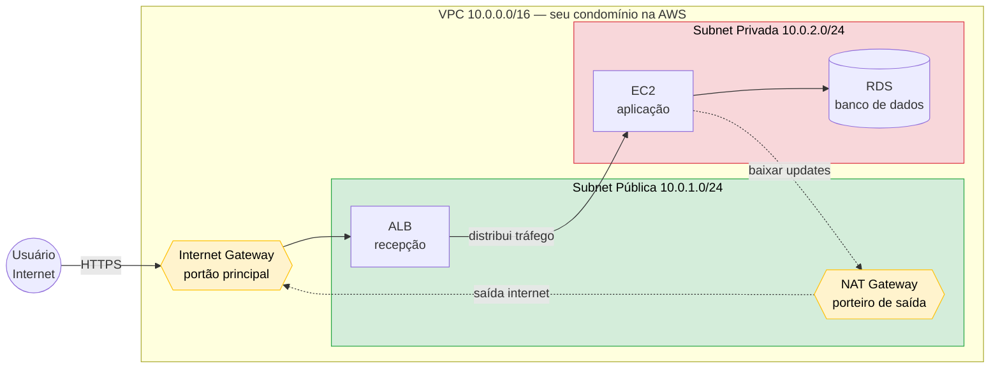

# 3.5 — Rede e Entrega de Conteúdo

> **Para quem não é da área de redes:** vamos focar no **propósito** de cada serviço, não na teoria pesada. Pense em rede como **encanamento** — você precisa saber o que cada cano faz, não como ele foi fundido.

---

## A grande analogia: VPC = um condomínio fechado

Imagine um **condomínio**:

- **VPC** = o **condomínio** (sua rede privada na AWS)
- **Subnets** = os **blocos** do condomínio (subdivisões)
- **Subnet pública** = bloco com **portaria** que dá pra rua (acessível pela internet)
- **Subnet privada** = bloco **só com acesso interno** (sem porta para a rua)
- **Internet Gateway (IGW)** = o **portão principal** do condomínio para a rua
- **NAT Gateway** = um **porteiro** que sai para comprar coisas na rua para os blocos privados, mas não deixa estranhos entrarem
- **Security Group** = o **segurança do apartamento** (porta da unidade)
- **NACL** = o **segurança do bloco** (porta do prédio)
- **Route Table** = o **mapa interno** que diz "para chegar lá fora, vá pelo portão X"

Pronto — com essa analogia, tudo da VPC se encaixa.

---

## Amazon VPC (Virtual Private Cloud)

**O que é:** sua **rede privada e isolada** dentro da AWS. Tudo que você cria (EC2, RDS) vive dentro de uma VPC.

**Como ler o diagrama:**
- 🟢 **Verde (pública)** — recebe tráfego da internet
- 🔴 **Vermelho (privada)** — sem acesso direto à internet (mais seguro)
- 🟡 **Amarelo (gateways)** — pontos de passagem
- **Linha sólida** = tráfego de entrada (usuário acessando o site)
- **Linha pontilhada** = tráfego de saída (EC2 baixando atualizações)

### Aquele número estranho: `10.0.0.0/16`

Quando você cria uma VPC, precisa definir uma **faixa de IPs** que ela vai usar. Esse é o **CIDR** — não precisa entender a matemática, só o tamanho:

| Notação | Quantidade de IPs | Uso típico |
|---------|-------------------|------------|
| **/16** | ~65.000 IPs | **VPC inteira** (dá pra muitas subnets) |
| **/24** | ~256 IPs | **Uma subnet** (suficiente para muitas EC2) |
| **/28** | 16 IPs | Subnet mínima |

**Regra prática:**
- VPC = **/16** (faixa grande)
- Subnet = **/24** (pedaço da VPC)

**Exemplo do diagrama:**
- VPC: `10.0.0.0/16` → todos os IPs de `10.0.0.0` até `10.0.255.255`
- Subnet pública: `10.0.1.0/24` → `10.0.1.0` até `10.0.1.255`
- Subnet privada: `10.0.2.0/24` → `10.0.2.0` até `10.0.2.255`

> 💡 **Faixas privadas reservadas** (não use IPs públicos na VPC):
> - `10.0.0.0/8` (mais comum na AWS)
> - `172.16.0.0/12`
> - `192.168.0.0/16`

> ⚠️ **Para a prova:** basta lembrar que **/16 é grande (VPC)** e **/24 é pequeno (subnet)**. A matemática não cai.

---

### Os 4 componentes que importam para o exame

| Componente | Para que serve | Analogia |
|------------|----------------|----------|
| **Subnet** | Divide a VPC. Pode ser pública ou privada | Bloco do condomínio |
| **Internet Gateway (IGW)** | Permite tráfego **entrando e saindo** pela internet | Portão principal |
| **NAT Gateway** | Permite que recursos privados **acessem a internet** (só saída) | Porteiro que sai pra comprar coisas |
| **Route Table** | Define **para onde** o tráfego vai | Mapa interno |

### Segurança em 2 camadas (já vista na Aula 2.5)

- **Security Group (SG)** — firewall na **instância** (EC2). Stateful, só allow.
- **NACL** — firewall na **subnet**. Stateless, allow + deny.

> 📚 Detalhes em [Aula 2.5](../02-seguranca-e-conformidade/2.5-protecao-rede.md).

### Conectando VPCs

| Serviço | Quando usar |
|---------|-------------|
| **VPC Peering** | Conectar **2 VPCs** (simples, barato) |
| **Transit Gateway** | Conectar **muitas VPCs** (hub central) |
| **VPC Endpoints** | Acessar serviços AWS (S3, etc.) **sem passar pela internet** |

> ⚠️ **Peering não é transitivo:** se A↔B e B↔C, A NÃO fala com C.

### VPC Endpoints — 2 tipos

| Tipo | Para quais serviços | Custo |
|------|---------------------|-------|
| **Gateway Endpoint** | Apenas **S3 e DynamoDB** | **Grátis** |
| **Interface Endpoint** | Outros serviços AWS (SNS, SQS, etc.) | Pago (por hora + GB) |

---

## Amazon Route 53 — DNS

**O que é:** o **catálogo telefônico** da internet — converte `meusite.com` no IP do servidor.

**3 funções principais:**
1. **DNS gerenciado** (resolve nomes para IPs)
2. **Registro de domínios** (você compra `.com` direto na AWS)
3. **Roteamento inteligente** (decide para qual servidor mandar)

### Políticas de roteamento (qual servidor escolher)

| Política | Quando usar |
|----------|-------------|
| **Simple** | 1 servidor só, sem lógica |
| **Weighted** | Dividir tráfego por % (A/B testing, canary) |
| **Latency** | Mandar para o servidor **mais rápido** |
| **Failover** | Se o principal cair, vai pro secundário |
| **Geolocation** | Decidir por **país do usuário** |
| **Multi-value** | Retorna várias opções (mini load balancing) |

> 💡 **Para a prova:** decore os nomes das políticas. Cai sempre.

---

## Amazon CloudFront — CDN

**O que é:** uma **rede de cache global** que entrega conteúdo do servidor mais próximo do usuário.

**Analogia:** é como ter **filiais de armazém** em todo o mundo. Em vez de mandar tudo de São Paulo para um cliente em Tóquio, você guarda cópia em Tóquio mesmo.

### Como funciona

1. Você guarda conteúdo num servidor de origem (S3, ALB, EC2)
2. CloudFront copia para **400+ Edge Locations** pelo mundo
3. Usuário acessa o Edge Location mais próximo → resposta em ms

### Características que caem

- ✅ Apenas **HTTP/HTTPS**
- ✅ Faz **cache** de conteúdo (estático e dinâmico)
- ✅ Integra com **WAF e Shield** (proteção)
- ✅ Lambda@Edge / CloudFront Functions (executar código na borda)

---

## AWS Global Accelerator

**O que é:** o "irmão" do CloudFront para **tráfego que NÃO é HTTP**.

**Diferença crucial:**

| | CloudFront | Global Accelerator |
|---|-----------|-------------------|
| Protocolo | **HTTP/HTTPS** | **TCP/UDP** |
| Cache? | Sim | Não |
| Caso de uso | Sites, APIs, vídeo | **Gaming, VoIP, IoT** |
| IP estático | Não | Sim (2 IPs anycast) |

> 💡 **Frase de ouro:** "CloudFront é para site, Global Accelerator é para jogo/voz."

---

## Conectividade com on-premises (DC do cliente ↔ AWS)

Para **engenheiros de dados:** isso aparece quando você precisa **migrar dados** ou **acessar dados internos** da empresa.

| Serviço | O que é | Quando usar |
|---------|---------|-------------|
| **Site-to-Site VPN** | Túnel criptografado **pela internet** | Conexão rápida de configurar, mais barata |
| **Direct Connect** | **Cabo de fibra dedicado** AWS↔seu DC | Latência previsível, sem internet, alto volume |
| **Client VPN** | VPN para **usuários finais** (laptop) | Funcionário acessar AWS de casa |
| **Transit Gateway** | Hub central para muitas VPCs/VPNs | Empresas grandes |

### VPN vs Direct Connect

| | VPN | Direct Connect |
|---|---|---|
| Tipo | Internet (IPsec) | Fibra dedicada |
| Setup | Minutos | **Semanas/meses** |
| Latência | Variável | **Previsível** |
| Custo | Baixo | Alto |

> 💡 Para data engineering: **Direct Connect** é o que se usa para mover **TBs/PBs** entre DC e AWS de forma estável.

---

## Elastic Load Balancing (ELB) — distribuir tráfego

**O que é:** **distribuidor de tráfego** entre várias instâncias.

**Analogia:** o **recepcionista** que manda cada cliente para uma mesa livre.

### 3 tipos que importam

| Tipo | Camada | Usado para | Lembre |
|------|--------|------------|--------|
| **ALB** (Application LB) | 7 | Web (HTTP/HTTPS) | Roteamento inteligente por URL |
| **NLB** (Network LB) | 4 | TCP/UDP de altíssima performance | IP estático, mais rápido |
| **GLB** (Gateway LB) | 3 | Appliances de rede (firewall) | Raro na prova |

> 💡 **Decoreba:** **A**LB para **A**plicação web · **N**LB para **N**etwork (TCP/UDP)

---

## Amazon API Gateway

**O que é:** porta de entrada para **APIs** que você cria.

**Para data engineering:** é como você expõe um Lambda que faz uma query no DynamoDB para um app mobile chamar.

**Recursos principais:**
- Cria **APIs REST, HTTP e WebSocket**
- Integra com **Lambda** (serverless)
- Faz **autenticação, throttling, cache, versionamento**

---

## Resumo visual — qual serviço usar

| Cenário | Serviço |
|---------|---------|
| "Rede privada para meus recursos" | **VPC** |
| "Subnet privada precisa baixar pacotes" | **NAT Gateway** |
| "DNS para meu domínio" | **Route 53** |
| "Cache global de site" | **CloudFront** |
| "Baixa latência para gaming/VoIP" | **Global Accelerator** |
| "Conectar DC à AWS de forma rápida" | **VPN** |
| "Conectar DC à AWS com fibra dedicada" | **Direct Connect** |
| "Distribuir tráfego HTTP entre EC2" | **ALB** |
| "Distribuir TCP de alta performance" | **NLB** |
| "Acessar S3 da VPC sem internet, grátis" | **Gateway Endpoint** |
| "Conectar 20 VPCs entre si" | **Transit Gateway** |
| "Expor uma API REST com Lambda" | **API Gateway** |

---

## Pontos-Chave para o Exame

- ✅ **VPC** é sua rede privada · **Subnets** dividem a VPC · **IGW** dá acesso público · **NAT** dá só saída para subnet privada.
- ✅ **Route 53** = DNS + registrar + roteamento inteligente.
- ✅ **CloudFront** = cache HTTP global · **Global Accelerator** = TCP/UDP global, sem cache.
- ✅ **ALB** = camada 7 (HTTP) · **NLB** = camada 4 (TCP/UDP, IP fixo).
- ✅ **VPN** = rápida e barata · **Direct Connect** = dedicada e previsível.
- ✅ **VPC Peering** = 2 VPCs (não transitivo) · **Transit Gateway** = muitas VPCs (hub).
- ✅ **Gateway Endpoint** = S3/DynamoDB grátis · **Interface Endpoint** = outros, pago.
- ✅ **Security Group** e **NACL** — ver Aula 2.5.

## Documentação Oficial (pt-BR)

- [Amazon VPC](https://docs.aws.amazon.com/pt_br/vpc/latest/userguide/what-is-amazon-vpc.html)
- [Amazon Route 53](https://docs.aws.amazon.com/pt_br/Route53/latest/DeveloperGuide/Welcome.html)
- [Amazon CloudFront](https://docs.aws.amazon.com/pt_br/AmazonCloudFront/latest/DeveloperGuide/Introduction.html)
- [AWS Global Accelerator](https://docs.aws.amazon.com/pt_br/global-accelerator/latest/dg/what-is-global-accelerator.html)
- [AWS Direct Connect](https://docs.aws.amazon.com/pt_br/directconnect/latest/UserGuide/Welcome.html)
- [Elastic Load Balancing](https://docs.aws.amazon.com/pt_br/elasticloadbalancing/latest/userguide/what-is-load-balancing.html)
- [API Gateway](https://docs.aws.amazon.com/pt_br/apigateway/latest/developerguide/welcome.html)

---

[← Aula anterior](./3.4-bancos-de-dados.md) | [Próxima aula → 3.6 Monitoramento](./3.6-monitoramento-gestao.md)
