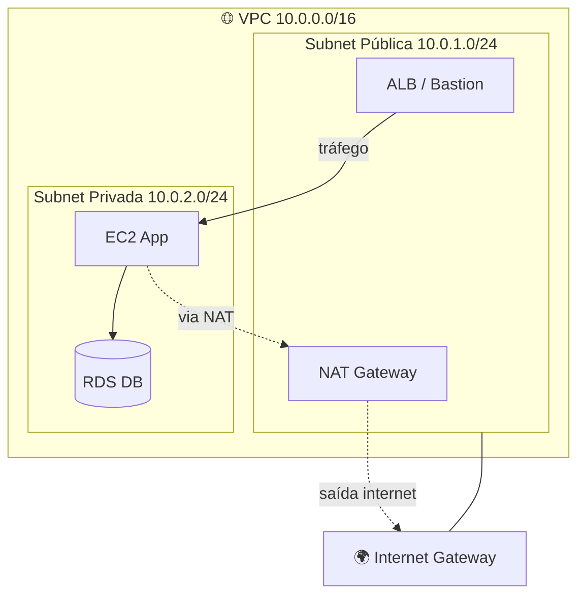

# 3.5 — Rede e Entrega de Conteúdo

## Amazon VPC (Virtual Private Cloud)

- **Rede virtual isolada** na AWS.

- Componentes:
  - **Subnets** (públicas / privadas)
  - **Internet Gateway (IGW)** — acesso público
  - **NAT Gateway** — subnets privadas acessam internet (saída)
  - **Route Tables** — tabelas de roteamento
  - **Security Groups** (stateful, na instância)
  - **NACLs** (stateless, na subnet)
  - **VPC Peering**, **Transit Gateway**
  - **VPC Endpoints** (Gateway para S3/DynamoDB, Interface para demais)

---

## Amazon Route 53

- **DNS gerenciado** (global).
- Tipos de registro: A, AAAA, CNAME, Alias, MX, TXT, etc.
- **Políticas de roteamento**:
  - **Simple**
  - **Weighted** (pesos)
  - **Latency** (latência)
  - **Failover** (ativo/passivo)
  - **Geolocation**
  - **Geoproximity**
  - **Multi-value**
- Também **registra domínios**.

---

## Amazon CloudFront

- **CDN** global com 400+ Edge Locations.
- Cache de conteúdo estático e dinâmico.
- Integrado com **S3, ALB, EC2, API Gateway**.
- Suporta **Lambda@Edge** e **CloudFront Functions**.
- Proteção com **AWS Shield + WAF**.

---

## AWS Global Accelerator

- Usa a **rede backbone da AWS** para melhorar performance global.
- Fornece **2 IPs anycast estáticos**.
- Ideal para **aplicações não-HTTP** (gaming, IoT, VoIP).

| Recurso | CloudFront | Global Accelerator |
|---------|-----------|-------------------|
| Protocolo | HTTP/HTTPS | TCP/UDP |
| Cache | Sim | Não |
| Uso | Conteúdo | Proximidade/rota |

---

## Conectividade com On-Premises

| Serviço | Descrição |
|---------|-----------|
| **AWS Site-to-Site VPN** | Túnel IPsec via internet |
| **AWS Client VPN** | VPN para usuários finais |
| **AWS Direct Connect** | Link dedicado (fibra); latência previsível |
| **Direct Connect Gateway** | Conecta DX a múltiplas VPCs |

---

## AWS Transit Gateway

- **Hub central** conectando VPCs, VPNs, Direct Connect.
- Simplifica arquiteturas com muitas VPCs.

---

## Elastic Load Balancing (ELB)

| Tipo | Camada | Uso |
|------|--------|-----|
| **ALB** | 7 (HTTP/HTTPS) | Web apps, microsserviços |
| **NLB** | 4 (TCP/UDP) | Alta performance, IPs estáticos |
| **GLB** | 3 | Appliances de rede |
| **CLB** (legacy) | 4/7 | Apps legados |

---

## Amazon API Gateway

- Cria e gerencia **APIs REST, HTTP e WebSocket**.
- Integra com Lambda, EC2, serviços externos.
- Auth, throttling, caching, versioning.

---

## Pontos-Chave para o Exame

- ✅ **IGW** para acesso público; **NAT** para saída de subnet privada.
- ✅ **Route 53** é DNS + registrar + roteamento inteligente.
- ✅ **CloudFront** = CDN (HTTP); **Global Accelerator** = TCP/UDP, sem cache.
- ✅ **Direct Connect** = link dedicado (não via internet).
- ✅ **ALB** L7; **NLB** L4.

## Documentação Oficial (pt-BR)

- [Amazon VPC](https://docs.aws.amazon.com/pt_br/vpc/latest/userguide/what-is-amazon-vpc.html)
- [Amazon Route 53](https://docs.aws.amazon.com/pt_br/Route53/latest/DeveloperGuide/Welcome.html)
- [Amazon CloudFront](https://docs.aws.amazon.com/pt_br/AmazonCloudFront/latest/DeveloperGuide/Introduction.html)
- [AWS Global Accelerator](https://docs.aws.amazon.com/pt_br/global-accelerator/latest/dg/what-is-global-accelerator.html)
- [AWS Direct Connect](https://docs.aws.amazon.com/pt_br/directconnect/latest/UserGuide/Welcome.html)
- [Elastic Load Balancing](https://docs.aws.amazon.com/pt_br/elasticloadbalancing/latest/userguide/what-is-load-balancing.html)
- [API Gateway](https://docs.aws.amazon.com/pt_br/apigateway/latest/developerguide/welcome.html)

---

[← Aula anterior](./3.4-bancos-de-dados.md) | [Próxima aula → 3.6 Monitoramento](./3.6-monitoramento-gestao.md)
