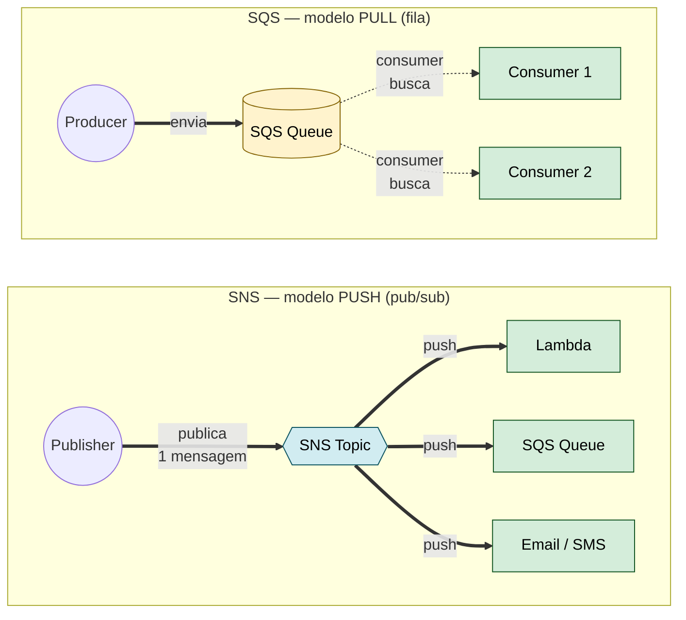
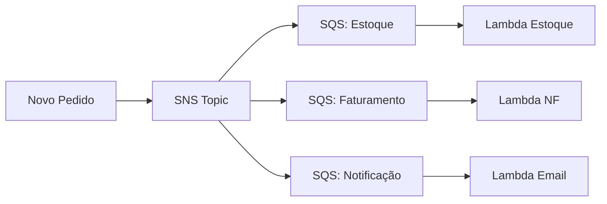

# 3.7 — Integração e Mensageria

> **Para que serve essa aula:** integrar serviços de forma **assíncrona** — quem produz não precisa esperar quem consome. Isso é a base de **arquiteturas modernas event-driven** e fundamental para pipelines de dados.

---

## Conceito-base: Síncrono vs Assíncrono

| | **Síncrono** | **Assíncrono** |
|---|---|---|
| Como funciona | A chama B e **espera resposta** | A entrega mensagem e **segue a vida** |
| Acoplamento | **Forte** (B precisa estar online) | **Fraco** (B pode estar offline) |
| Exemplo | API REST, RDS query | SNS, SQS, EventBridge |
| Vantagem | Resposta imediata | Resiliência, escala |

**Analogia:**
- **Síncrono** = telefonema (precisa do outro lado atender)
- **Assíncrono** = WhatsApp (manda e o outro lê quando puder)

---

**Como ler:**
- 🔵 **SNS (push)** — uma mensagem é **empurrada** para todos os subscribers ao mesmo tempo
- 🟡 **SQS (pull)** — mensagem fica na fila até o consumer **buscar** (no seu próprio ritmo)
- **Setas sólidas** (==>) = entrega imediata · **Setas pontilhadas** (-.->) = consumer puxa quando quiser

---

## Amazon SNS — Simple Notification Service

**O que é:** sistema **Pub/Sub** — um publisher manda mensagem para um **tópico**, e **vários subscribers recebem ao mesmo tempo**.

**Analogia:** rádio AM — uma estação transmite, todos os rádios ligados naquela frequência ouvem.

### Características

- **Push** — SNS empurra a mensagem para os subscribers
- Subscribers possíveis: **SQS, Lambda, HTTP/HTTPS, Email, SMS, mobile push, Kinesis Firehose**
- Mensagens até **256 KB**
- Suporta versão **FIFO** (ordem garantida)

**Casos de uso:**
- Notificar várias áreas quando algo acontece (ex: novo pedido → email + SMS + Lambda)
- Fan-out para múltiplas filas SQS

---

## Amazon SQS — Simple Queue Service

**O que é:** **fila de mensagens**. Producer coloca mensagem, consumer **puxa** quando estiver pronto.

**Analogia:** caixa de correio — você deposita cartas, o destinatário pega quando puder.

### Tipos de fila

| Tipo | Throughput | Ordem | Entrega |
|------|-----------|-------|---------|
| **Standard** | Quase ilimitado | **Não garantida** | At-least-once (pode duplicar) |
| **FIFO** | 300 msg/s (3.000 com batch) | **Garantida** | **Exactly-once** |

### Conceitos importantes

| Conceito | O que é |
|----------|---------|
| **Visibility Timeout** | Tempo que mensagem fica "invisível" depois de lida (default 30s) — evita 2 consumers processando a mesma |
| **Dead Letter Queue (DLQ)** | Fila secundária para mensagens que falham N vezes — investigação posterior |
| **Long Polling** | Consumer espera até mensagem chegar (mais barato que polling constante) |
| **Retenção** | Padrão 4 dias, máximo **14 dias** |
| **Tamanho** | Até **256 KB** por mensagem |

> 💡 **Pegadinha:** "garantir ordem das mensagens" → **SQS FIFO** (não Standard).

---

## SNS + SQS — o padrão Fan-Out

Combinação **clássica** em arquiteturas AWS: SNS publica em **múltiplas filas SQS**, cada uma com seu consumer independente.

**Por quê?** Cada serviço processa no seu ritmo, sem perder mensagens se um cair.

> 💡 Cai como: "preciso processar o mesmo evento em vários lugares de forma desacoplada" → **SNS + SQS Fan-Out**.

---

## Amazon EventBridge

**O que é:** **event bus serverless** que roteia eventos entre serviços AWS, **SaaS de terceiros** e suas aplicações.

**Diferença do SNS:**

| | **SNS** | **EventBridge** |
|---|---|---|
| Modelo | Pub/Sub simples | Event bus com **pattern matching** |
| Origens | Sua aplicação | AWS, SaaS (Salesforce, Datadog, Stripe), suas apps |
| Filtragem | Filtros básicos | **Regras complexas** baseadas em conteúdo do evento |
| Schema Registry | Não | **Sim** (auto-discover de schemas) |
| Latência | < 100ms | ~ 500ms |
| Caso de uso | Notificação simples | **Integração entre serviços e SaaS** |

> 💡 **Frase para a prova:** "EventBridge é o **CloudWatch Events evoluído** + integração com SaaS externos."

---

## AWS Step Functions

**O que é:** **orquestrador de workflows** — coordena chamadas a vários serviços em ordem, com lógica condicional.

**Analogia:** maestro de orquestra — diz quem toca, em que ordem e o que fazer se alguém errar.

### Tipos de workflow

| Tipo | Duração | Caso de uso |
|------|---------|-------------|
| **Standard** | Até 1 ano | Processos longos, auditáveis (contratos, aprovações) |
| **Express** | Até 5 minutos | Alta frequência, IoT, streaming |

### Recursos

- **Visual workflow** em JSON (diagrama gerado automaticamente)
- Suporta **paralelismo, retries, try/catch, escolhas condicionais**
- Integra com **Lambda, ECS, SNS, SQS, DynamoDB, etc.**

> 💡 Cai como: "precisa orquestrar múltiplos Lambdas com lógica de retry e estados" → **Step Functions**.

---

## Amazon MQ

**O que é:** **message broker gerenciado** — ActiveMQ ou RabbitMQ.

**Quando usar:**
- Sistema **legado** que já usa protocolos padrão (**AMQP, MQTT, STOMP, OpenWire, WSS**)
- Migração lift-and-shift de broker on-premises

**Quando NÃO usar:**
- Aplicações novas → use **SNS + SQS** (mais barato, mais escalável)

> 💡 **Frase para a prova:** "Sistema legado com AMQP/MQTT/STOMP" → **Amazon MQ**. "Aplicação cloud-native nova" → **SNS + SQS**.

---

## Amazon AppFlow

**O que é:** integração **SaaS ↔ AWS sem código**.

**Conecta:**
- **SaaS:** Salesforce, ServiceNow, Slack, Google Analytics, Zendesk, SAP
- **AWS:** S3, Redshift, EventBridge

**Casos de uso:**
- Carregar dados de Salesforce no Redshift para BI
- Enviar dados do S3 para Salesforce automaticamente

> 💡 Para data engineering: AppFlow + AppFlow Glue Connectors são úteis para ingestão de SaaS no data lake.

---

## Comparação consolidada

| Serviço | Padrão | Ordem | Caso de uso |
|---------|--------|-------|-------------|
| **SNS** | Pub/Sub (push) | FIFO opcional | Notificações para vários destinos |
| **SQS** | Fila (pull) | FIFO opcional | Desacoplamento producer/consumer |
| **EventBridge** | Event bus (pattern) | Não | Integração com SaaS, eventos AWS |
| **Step Functions** | Orquestração | Determinística | Workflows com lógica complexa |
| **Amazon MQ** | Broker tradicional | Sim | Legado AMQP/MQTT/STOMP |
| **AppFlow** | ETL SaaS | — | Ingestão de SaaS sem código |

---

## Recursos extras que aparecem na prova

### SNS

- **Message Filtering** — cada subscriber recebe **só o que importa** (filtro por atributo da mensagem). Ex: SNS de pedidos → só "região=SP" vai para Lambda específico.
- **Mobile Push** — notificações para apps via **APNS (iOS), FCM (Android), Baidu, ADM**. Cenário típico: "notificar usuários do app".

### SQS

- **Cobrança:** pago **por requisição** (não por mensagem armazenada). Free tier: **1M requisições/mês para sempre**.
- **Delay Queue** — atrasa entrega de uma mensagem por até **15 minutos** (útil para "agendar" processamento).
- **Idempotência:** Standard pode duplicar → consumer precisa ser idempotente. FIFO já garante exactly-once.
- Mensagem é **deletada manualmente** pelo consumer após processar (ou expira pela retenção).

### EventBridge

- **EventBridge Pipes** — conecta **source → enrichment → target** sem código (Kinesis → Lambda enrich → SQS, por exemplo).
- **EventBridge Scheduler** — sucessor do CloudWatch Events Rules para **tarefas agendadas** (cron na nuvem).
- **Default bus** (eventos AWS) · **Custom bus** (suas apps) · **Partner bus** (SaaS — Datadog, Zendesk, etc.).

### Step Functions

- **Workflow Studio** — editor **visual drag-and-drop** (não precisa escrever JSON na mão).
- Estados: **Task, Choice, Parallel, Map, Wait, Pass, Succeed, Fail**.
- **Map state** processa arrays em paralelo (útil para batch).
- Cobrança: **Standard** paga por **transição de estado** · **Express** paga por **execução + duração**.

> 💡 **Para streaming em tempo real** (vídeo ao vivo, IoT contínuo, milhões de eventos/s) → use **Kinesis** (visto na [Aula 3.9](./3.9-analytics-ia-ml.md)). SNS/SQS são para mensageria **pontual**, não streaming.

---

## Cenários típicos da prova

| Cenário | Serviço |
|---------|---------|
| "Um evento, vários consumidores diferentes" | **SNS** (ou SNS + SQS Fan-Out) |
| "Desacoplar producer de consumer com processamento eventual" | **SQS** |
| "Garantir ordem e não duplicar mensagens" | **SQS FIFO** |
| "Mensagens que falham precisam ser investigadas" | **SQS Dead Letter Queue (DLQ)** |
| "Roteamento de eventos com filtros complexos" | **EventBridge** |
| "Integrar Salesforce com S3 sem código" | **AppFlow** ou **EventBridge** |
| "Workflow de aprovação com etapas e condicionais" | **Step Functions Standard** |
| "Workflow de IoT alta frequência (<5 min)" | **Step Functions Express** |
| "Sistema legado usa protocolo MQTT/AMQP" | **Amazon MQ** |
| "Notificar email + SMS + Lambda do mesmo evento" | **SNS** |
| "Aplicação cloud-native nova" | **SNS + SQS** (não MQ) |

---

## Pontos-Chave para o Exame

- ✅ **SNS = push (pub/sub)** · **SQS = pull (fila)**.
- ✅ **SQS Standard** = throughput alto, pode duplicar · **SQS FIFO** = ordem + exactly-once.
- ✅ **SQS retenção** padrão 4 dias, máximo **14 dias**, mensagem até **256 KB**.
- ✅ **DLQ** captura mensagens que falham várias vezes.
- ✅ **EventBridge** = CloudWatch Events evoluído + integração com **SaaS**.
- ✅ **Step Functions** orquestra workflows; **Standard** até 1 ano · **Express** até 5 min.
- ✅ **Amazon MQ** = AMQP/MQTT/STOMP legado · **SNS+SQS** = cloud-native nova.
- ✅ **AppFlow** = ETL sem código entre SaaS e AWS.
- ✅ **SNS + SQS Fan-Out** é o padrão clássico para distribuir um evento a vários consumers.

## Documentação Oficial (pt-BR)

- [Amazon SNS](https://docs.aws.amazon.com/pt_br/sns/latest/dg/welcome.html)
- [Amazon SQS](https://docs.aws.amazon.com/pt_br/AWSSimpleQueueService/latest/SQSDeveloperGuide/welcome.html)
- [Amazon EventBridge](https://docs.aws.amazon.com/pt_br/eventbridge/latest/userguide/eb-what-is.html)
- [AWS Step Functions](https://docs.aws.amazon.com/pt_br/step-functions/latest/dg/welcome.html)
- [Amazon MQ](https://docs.aws.amazon.com/pt_br/amazon-mq/latest/developer-guide/welcome.html)
- [Amazon AppFlow](https://docs.aws.amazon.com/pt_br/appflow/latest/userguide/what-is-appflow.html)

---

[← Aula anterior](./3.6-monitoramento-gestao.md) | [Próxima aula → 3.8 Dev Tools](./3.8-ferramentas-desenvolvedor.md)
