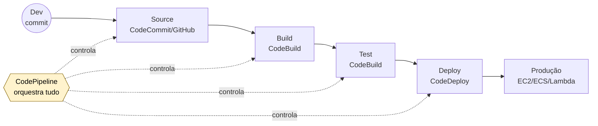

# 3.8 — Ferramentas para Desenvolvedores

> **Para que serve essa aula:** automatizar o ciclo de vida do código — do commit até a produção — e dar ferramentas para devs trabalharem mais rápido na AWS.

---

## Conceito-base: CI/CD

| Sigla | Significa | O que automatiza |
|-------|-----------|------------------|
| **CI** (Continuous Integration) | Integração contínua | Código → **build** → **testes** automatizados |
| **CD** (Continuous Delivery) | Entrega contínua | Testes passaram → **artefato pronto** para deploy manual |
| **CD** (Continuous Deployment) | Deployment contínuo | Testes passaram → **deploy automático** em produção |

**Analogia:** linha de montagem de fábrica. Cada etapa só passa para a próxima se a anterior aprovar.

---

## Pipeline canônico AWS



> 💡 **Decoreba:** **Pipeline** orquestra · **Build** compila/testa · **Deploy** publica.

---

## Suíte "Code"

| Serviço | Função | Observação |
|---------|--------|------------|
| **CodeCommit** | Repositório Git privado | **Descontinuado** para novos clientes (use GitHub/GitLab) |
| **CodeBuild** | Build e testes | Serverless, paga por minuto |
| **CodeDeploy** | Deploy em EC2, ECS, Lambda, on-prem | Várias estratégias (ver abaixo) |
| **CodePipeline** | Orquestração CI/CD | "Maestro" da pipeline |
| **CodeArtifact** | Repositório privado de pacotes (npm, Maven, PyPI, NuGet) | Substitui Nexus/Artifactory |
| **CodeGuru** | IA para código | 3 produtos (ver abaixo) |
| **CodeStar** | Templates de projeto | **Descontinuado** |

### CodeDeploy — estratégias de deployment

| Estratégia | Como funciona | Quando usar |
|------------|--------------|-------------|
| **In-place** | Substitui aplicação **nas mesmas instâncias** (com downtime) | Ambientes simples, dev |
| **Blue/Green** | Cria **ambiente novo** paralelo, troca o tráfego | Produção crítica (rollback fácil) |
| **Canary** | Libera para **% pequena** primeiro, depois resto | Lambda/ECS — risco controlado |
| **Linear** | Incrementos iguais (ex: 10% a cada 10 min) | Lambda/ECS — rollout gradual |
| **All-at-once** | Tudo de uma vez | Dev/teste, mais arriscado |

> 💡 As estratégias acima são **opções nativas do CodeDeploy** — você escolhe na lista, sem programar.

### Configurações prontas — liberar X% em Y minutos

A AWS oferece **Deployment Configurations pré-definidas** (você escolhe ao criar o Deployment Group):

**Para Lambda e ECS:**

| Nome no console | Comportamento |
|----------------|---------------|
| `LambdaAllAtOnce` | 100% de uma vez |
| `LambdaCanary10Percent5Minutes` | **10% agora, 90% após 5 min** |
| `LambdaCanary10Percent30Minutes` | **10% agora, 90% após 30 min** |
| `LambdaLinear10PercentEvery1Minute` | **+10% a cada 1 min** (10 etapas) |
| `LambdaLinear10PercentEvery10Minutes` | **+10% a cada 10 min** |

**Para EC2 / On-premises:**

| Nome no console | Comportamento |
|----------------|---------------|
| `AllAtOnce` | Todas instâncias ao mesmo tempo |
| `HalfAtATime` | 50% por vez |
| `OneAtATime` | Uma instância de cada vez |

> 💡 Também é possível criar **Custom Deployment Configurations** (ex: 5% por 1 hora). Para o CLF-C02, basta saber as prontas.

> 💡 **Cenário típico:** "deploy sem downtime + rollback rápido" → **Blue/Green** · "10% por 30 minutos antes do resto" → **LambdaCanary10Percent30Minutes**.

### CodeGuru — 3 produtos diferentes

| Produto | Função |
|---------|--------|
| **CodeGuru Reviewer** | Revisão **automatizada de código** com IA (Python, Java) — sugere boas práticas |
| **CodeGuru Profiler** | Análise de **performance em produção** — identifica CPU/memória/latência |
| **CodeGuru Security** | Escaneia código por **vulnerabilidades de segurança** |

---

## AWS SAM (Serverless Application Model)

**O que é:** "**CloudFormation simplificado para serverless**". Define Lambda + API Gateway + DynamoDB com poucas linhas.

**Por que existe:** CloudFormation puro para serverless é verboso. SAM tem **abstrações específicas**.

```yaml
# SAM: 5 linhas
Resources:
  MyFunction:
    Type: AWS::Serverless::Function
    Properties:
      Runtime: python3.12
      Handler: app.handler
```

**Vantagens:**
- **SAM CLI** para teste local de Lambda
- Gera CloudFormation por baixo
- Mais simples que CDK para serverless puro

> 💡 **Pegadinha:** "ferramenta para desenvolver e testar **Lambda localmente**" → **SAM CLI**.

---

## AWS X-Ray — Tracing Distribuído

**O que é:** rastreia o **caminho completo** de uma requisição que passa por **vários serviços**.

**Analogia:** rastreador de encomenda. Você vê **cada etapa** que o pacote passou (centro de distribuição A → B → C → entregador) e **quanto tempo** demorou em cada uma.

### Por que precisa?

Em microsserviços, uma requisição pode passar por **10+ Lambdas/serviços**. Quando algo está lento, **onde está o problema?**

X-Ray mostra:
- O **fluxo visual** entre serviços
- **Latência** de cada etapa
- **Onde aconteceu o erro**

### Tracing vs Logs

| | **CloudWatch Logs** | **X-Ray** |
|---|---|---|
| O que mostra | Mensagens do app | **Fluxo entre serviços** |
| Foco | "O que aconteceu?" | "**Onde** o erro ocorreu e por quê?" |
| Visualização | Texto | **Mapa de serviços** |

> 💡 **Cenário típico:** "aplicação serverless lenta, preciso identificar o gargalo entre Lambdas" → **X-Ray**.

---

## AWS AppConfig — Feature Flags

**O que é:** liga/desliga funcionalidades **sem redeployar** a aplicação.

**Casos de uso:**
- Lançar feature para **10% dos usuários** primeiro
- **Rollback instantâneo** se a feature der problema
- A/B testing
- Configuração dinâmica em produção (sem rebuild)

**Analogia:** disjuntores em um quadro elétrico — você desliga uma sala sem desligar a casa toda.

---

## Amazon CodeWhisperer / Amazon Q Developer

**O que é:** assistentes de IA generativa para programadores (autocomplete inteligente).

| Serviço | Função |
|---------|--------|
| **Amazon CodeWhisperer** | Sugestões de código em IDEs (VS Code, JetBrains) — em transição para Q |
| **Amazon Q Developer** | Evolução do CodeWhisperer + chat + diagnóstico AWS |
| **Amazon Q Business** | Assistente para empresas (busca em docs internas) |

> 💡 **Free tier individual:** Q Developer tem versão **grátis para uso pessoal** (login com Builder ID).

---

## AWS Cloud9 e Ambientes de Dev

| Serviço | Função | Observação |
|---------|--------|------------|
| **AWS Cloud9** | IDE no navegador, colaborativa | **Descontinuada** para novos clientes |
| **AWS CloudShell** | Terminal no navegador com CLI pré-instalada | **Grátis**, 1 GB persistente por região |
| **AWS Toolkit** | Extensões oficiais para VS Code, JetBrains, Visual Studio | Integra console AWS na IDE |

### CloudShell — detalhes que caem

- ✅ **Gratuito**
- ✅ **Pré-autenticado** (mesma sessão do console)
- ✅ **1 GB de armazenamento persistente** por região
- ✅ Disponível em **várias regiões**
- ✅ Tem `aws cli`, `git`, Python, Node já instalados

---

## SDK e CLI

| Ferramenta | Para quê |
|------------|----------|
| **AWS SDK** | Bibliotecas para chamar AWS **a partir do código** (Python `boto3`, JS, Java, Go, .NET, Ruby, PHP) |
| **AWS CLI** | Comandos no **terminal** (`aws s3 ls`, `aws ec2 describe-instances`) |
| **AWS CloudShell** | CLI **pré-instalada no navegador** (sem instalar nada local) |

> 💡 **Decoreba:** **SDK** para seu código · **CLI** para scripts/automação · **CloudShell** para terminal rápido.

---

## Cenários típicos da prova

| Cenário | Serviço |
|---------|---------|
| "Orquestrar pipeline CI/CD na AWS" | **CodePipeline** |
| "Build e testes serverless paga por minuto" | **CodeBuild** |
| "Deploy sem downtime com rollback fácil" | **CodeDeploy Blue/Green** |
| "Liberar Lambda para 10% dos usuários primeiro" | **CodeDeploy Canary** |
| "Repositório privado de pacotes npm/Maven/PyPI" | **CodeArtifact** |
| "Revisão automatizada de código com IA" | **CodeGuru Reviewer** |
| "Identificar gargalos de CPU em produção" | **CodeGuru Profiler** |
| "Vulnerabilidades de segurança no código" | **CodeGuru Security** |
| "Deploy de Lambda + API Gateway + DynamoDB simplificado" | **AWS SAM** |
| "Testar Lambda localmente antes do deploy" | **SAM CLI** |
| "Identificar gargalo entre microsserviços/Lambdas" | **X-Ray** |
| "Ligar/desligar feature sem redeploy" | **AppConfig** |
| "Autocomplete inteligente de código com IA" | **CodeWhisperer / Q Developer** |
| "Terminal AWS grátis no navegador" | **CloudShell** |
| "Chamar AWS no meu código Python" | **SDK (boto3)** |
| "Automatizar via shell script" | **CLI** |

---

## Pontos-Chave para o Exame

- ✅ **CodePipeline** orquestra · **CodeBuild** builda/testa · **CodeDeploy** implanta · **CodeArtifact** guarda pacotes.
- ✅ **CodeDeploy** suporta **In-place, Blue/Green, Canary, Linear** — Blue/Green é a queridinha de produção.
- ✅ **CodeGuru** = 3 produtos: **Reviewer (código), Profiler (performance), Security (vulns)**.
- ✅ **AWS SAM** = CloudFormation simplificado **para serverless**, com SAM CLI para teste local.
- ✅ **X-Ray** = tracing distribuído (mapa de serviços e latência).
- ✅ **AppConfig** = feature flags (ligar/desligar sem redeploy).
- ✅ **CloudShell** = terminal grátis no navegador, 1 GB persistente, pré-autenticado.
- ✅ **CodeCommit, Cloud9 e CodeStar** estão descontinuados para novos clientes.
- ✅ **SDK** para código · **CLI** para scripts.

## Documentação Oficial (pt-BR)

- [AWS CodePipeline](https://docs.aws.amazon.com/pt_br/codepipeline/latest/userguide/welcome.html)
- [AWS CodeBuild](https://docs.aws.amazon.com/pt_br/codebuild/latest/userguide/welcome.html)
- [AWS CodeDeploy](https://docs.aws.amazon.com/pt_br/codedeploy/latest/userguide/welcome.html)
- [AWS CodeGuru](https://docs.aws.amazon.com/pt_br/codeguru/latest/reviewer-ug/welcome.html)
- [AWS SAM](https://docs.aws.amazon.com/pt_br/serverless-application-model/latest/developerguide/what-is-sam.html)
- [AWS X-Ray](https://docs.aws.amazon.com/pt_br/xray/latest/devguide/aws-xray.html)
- [AWS AppConfig](https://docs.aws.amazon.com/pt_br/appconfig/latest/userguide/what-is-appconfig.html)
- [AWS CloudShell](https://docs.aws.amazon.com/pt_br/cloudshell/latest/userguide/welcome.html)

---

[← Aula anterior](./3.7-integracao-mensageria.md) | [Próxima aula → 3.9 Analytics & IA](./3.9-analytics-ia-ml.md)
