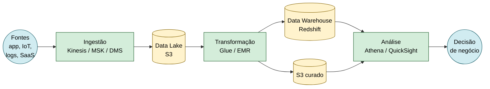

# 3.9 — Analytics, IA e Machine Learning

> **Para que serve essa aula:** transformar **dados brutos** em **decisão de negócio**. A AWS tem serviços para cada etapa: ingerir → armazenar → processar → analisar → aplicar IA.

---

## Pipeline de dados típico na AWS



> 💡 **Decoreba:** **S3 = data lake** · **Redshift = data warehouse** · **Glue = ETL** · **Athena = SQL no S3** · **QuickSight = BI**.

---

# Analytics

## Amazon Athena

**O que é:** roda **queries SQL diretamente sobre dados no S3** — sem servidor, sem carregar nada.

- **Serverless** — paga por TB de dado escaneado
- Suporta CSV, JSON, Parquet, ORC, Avro
- Integra com **Glue Data Catalog** (metadados)

> 💡 **Cenário típico:** "consultar logs no S3 com SQL sem montar infra" → **Athena**.

> ⚠️ **Pegadinha:** Athena é **OLAP serverless** sobre S3. Para data warehouse robusto com PB → **Redshift**.

---

## AWS Glue

**O que é:** **ETL serverless** (Extract, Transform, Load) + **catálogo de metadados**.

| Componente | Função |
|------------|--------|
| **Glue Crawler** | Descobre schema dos dados no S3 e popula o catálogo |
| **Glue Data Catalog** | Metastore central (compatível com Hive) |
| **Glue ETL Jobs** | Processa dados (Python/Scala via Spark gerenciado) |
| **Glue Studio** | Interface visual drag-and-drop para ETL |
| **Glue DataBrew** | ETL **sem código** para analistas |

> 💡 **Cenário típico:** "transformar JSON em Parquet automaticamente" → **Glue Job** + **Crawler**.

---

## Amazon EMR (Elastic MapReduce)

**O que é:** **cluster gerenciado** de Hadoop, Spark, Hive, Presto, HBase.

**Quando usar (vs Glue):**
- Você **já tem código Spark/Hadoop** e quer migrar
- Precisa de **controle fino** do cluster
- Workloads **muito grandes** (PB) com tuning específico

**Quando NÃO usar:**
- Workload pequeno/médio → **Glue** (mais simples, serverless)

---

## Amazon Kinesis — streaming em tempo real

**O que é:** ingestão e processamento de **streams contínuos** (milhões de eventos/segundo).

### Os 4 sabores

| Variação | Função | Caso de uso |
|----------|--------|-------------|
| **Data Streams** | Ingestão real-time, retenção 24h-365d | Você processa com Lambda/EMR/aplicação |
| **Data Firehose** | **Entrega gerenciada** para S3, Redshift, OpenSearch, Splunk | "Despejar" stream em destino sem código |
| **Data Analytics** | **SQL sobre streams** (sucessor: Managed Service for Apache Flink) | Agregações em tempo real |
| **Video Streams** | **Vídeo ao vivo** | Câmeras IoT, live streaming |

> 💡 **Cenário típico:**
> - "Coletar clickstream em tempo real" → **Kinesis Data Streams**
> - "Mandar logs direto para S3 sem código" → **Kinesis Firehose**
> - "Rodar SQL em stream" → **Kinesis Data Analytics**

---

## Amazon MSK (Managed Streaming for Apache Kafka)

**O que é:** **Kafka gerenciado** pela AWS.

**Diferença para Kinesis:**

| | **Kinesis Data Streams** | **MSK (Kafka)** |
|---|---|---|
| Tecnologia | AWS proprietária | **Apache Kafka** open-source |
| Portabilidade | Só AWS | Multi-cloud, on-premises |
| Quando usar | App nativa AWS | Empresa já usa Kafka |

---

## Amazon QuickSight

**O que é:** ferramenta de **BI** (dashboards, gráficos) — concorrente do Power BI/Tableau.

- **SPICE** — engine in-memory para acelerar queries
- Conecta a S3, RDS, Redshift, Athena, Salesforce
- Cobrança **por usuário ou por sessão**
- **Q (QuickSight Q)** — perguntas em linguagem natural ("qual a venda do mês passado?")

---

## Amazon OpenSearch

**O que é:** **busca e analytics** sobre logs/textos. Fork do Elasticsearch.

**Casos de uso:**
- Busca em catálogo de produtos
- Análise de logs (ELK stack equivalente)
- SIEM (segurança)

---

## AWS Data Exchange

- **Marketplace** de datasets prontos (terceiros vendem dados, você compra/assina).
- Útil para enriquecer análises com dados externos (financeiros, demográficos, climáticos).

---

## Tabela comparativa — Analytics

| Cenário | Serviço |
|---------|---------|
| SQL serverless sobre dados em S3 | **Athena** |
| Data warehouse para PB com queries complexas | **Redshift** |
| ETL serverless com catálogo | **AWS Glue** |
| ETL sem código para analistas | **Glue DataBrew** |
| Cluster Hadoop/Spark customizado | **EMR** |
| Streaming proprietário AWS | **Kinesis Data Streams** |
| Stream → S3/Redshift sem código | **Kinesis Firehose** |
| Kafka gerenciado | **MSK** |
| Dashboards e BI | **QuickSight** |
| Busca em logs/textos | **OpenSearch** |
| Comprar datasets externos | **Data Exchange** |

---

# Inteligência Artificial e Machine Learning

A AWS oferece IA em **3 níveis** — quanto mais alto, menos você precisa entender de ML.

```
🟢 Nível 3 — IA pronta via API       ← você só chama, não treina
   ├─ Serviços específicos (Rekognition, Polly, etc.)
   └─ IA Generativa (Bedrock, Amazon Q)
🟡 Nível 2 — Plataforma ML            ← você treina seu próprio modelo
   └─ SageMaker (build, train, deploy)
🔴 Nível 1 — Frameworks brutos        ← você programa do zero
   └─ TensorFlow, PyTorch em EC2/EMR
```

---

## Nível 3a — Serviços de IA prontos (específicos)

**Você não precisa saber ML.** Cada serviço resolve **uma tarefa específica** via API.

| Serviço | O que faz | Cenário típico |
|---------|-----------|----------------|
| **Rekognition** | Visão computacional em imagens/vídeos | Detectar rostos, objetos, conteúdo impróprio |
| **Polly** | **Texto → fala** (TTS) | Locução automática, audiobook |
| **Transcribe** | **Fala → texto** (STT) | Legendas, transcrição de reuniões |
| **Translate** | Tradução de idiomas | Sites multilíngues |
| **Comprehend** | **NLP** (sentimento, entidades, idioma) | Análise de reviews, classificação |
| **Comprehend Medical** | NLP **médico** (diagnósticos, medicamentos) | Saúde |
| **Lex** | **Chatbots** (motor do Alexa) | Atendimento automatizado |
| **Textract** | Extrai **texto + tabelas + formulários** de PDFs/imagens | OCR estruturado |
| **Personalize** | Sistema de **recomendação** (estilo Netflix) | "Produtos para você" |
| **Forecast** | Previsão de **séries temporais** | Demanda, vendas, estoque |
| **Kendra** | **Busca empresarial inteligente** (responde perguntas) | Q&A em docs internos |
| **Fraud Detector** | Detecção de **fraude** | Pagamentos, cadastros falsos |

> 💡 **Decoreba rápida:**
> - **Rekognition** = imagem · **Textract** = documento
> - **Polly** = texto vira voz · **Transcribe** = voz vira texto
> - **Translate** = idioma · **Comprehend** = sentimento/NLP
> - **Lex** = chatbot · **Kendra** = busca empresarial

---

## Nível 2 — Amazon SageMaker

**O que é:** plataforma **end-to-end** para Machine Learning. Você treina **seus próprios modelos**.

**Etapas que cobre:**

| Etapa | Componente |
|-------|------------|
| Preparação de dados | **SageMaker Data Wrangler** |
| Notebook de exploração | **SageMaker Studio** (Jupyter gerenciado) |
| Treinamento | **SageMaker Training Jobs** |
| Tuning de hiperparâmetros | **Automatic Model Tuning** |
| Deploy do modelo | **SageMaker Endpoints** |
| Monitoramento | **Model Monitor** |
| AutoML (sem código) | **SageMaker Canvas, Autopilot** |
| Marketplace de modelos | **JumpStart** |

> 💡 **Cenário típico:** "treinar modelo customizado de previsão de churn" → **SageMaker**.

---

## Nível 3b — IA Generativa

**Modelos generalistas** que respondem qualquer prompt (chat, geração de texto/imagem). Você só chama via API — sem treinar.

### Amazon Bedrock

**O que é:** acesso a **modelos de fundação** (Foundation Models) via API gerenciada.

**Modelos disponíveis:**
- **Anthropic Claude** (mesmo modelo que escreve isto)
- **Meta Llama**
- **Amazon Titan** (proprietário AWS)
- **AI21 Jurassic**
- **Cohere Command**
- **Stability AI** (geração de imagem)

**Características:**
- **Sem servidor** — só API
- **Privacidade** — seus dados não treinam o modelo
- **Customização** — fine-tuning com seus dados
- **Knowledge Bases** — RAG gerenciado (busca em docs próprios)
- **Agents** — agentes que executam ações

> 💡 **Cenário típico:** "criar chatbot que responde com base em manuais internos" → **Bedrock + Knowledge Bases**.

---

### Amazon Q — assistente IA da AWS

| Variante | Para quem | Função |
|----------|-----------|--------|
| **Amazon Q Developer** | **Desenvolvedores** | Autocomplete + chat de código (substituiu CodeWhisperer) |
| **Amazon Q Business** | **Empresas** | Busca + Q&A em docs/sistemas internos (Slack, SharePoint, Drive) |
| **Q in QuickSight** | **Analistas** | "Pergunta em linguagem natural" sobre dashboards |
| **Q in Connect** | **Atendimento** | Sugere respostas para agentes em tempo real |

---

## Bedrock vs SageMaker vs Serviços prontos

| Você quer... | Use |
|--------------|-----|
| Detectar rosto, traduzir texto, extrair de PDF | **Serviços prontos** (Rekognition, Translate, Textract) |
| Treinar modelo **customizado com seus dados** | **SageMaker** |
| Usar **LLM (chatbot, geração)** sem treinar | **Bedrock** |
| Assistente de IA **dentro de produtos AWS** | **Amazon Q** |

---

## Cenários típicos da prova

| Cenário | Serviço |
|---------|---------|
| "SQL serverless sobre logs no S3" | **Athena** |
| "ETL serverless de JSON para Parquet" | **Glue** |
| "Cluster Spark gerenciado" | **EMR** |
| "Streaming de clickstream em tempo real" | **Kinesis Data Streams** |
| "Stream entregue automaticamente em S3/Redshift" | **Kinesis Firehose** |
| "Kafka gerenciado" | **MSK** |
| "Dashboards de BI" | **QuickSight** |
| "Busca em logs (ELK)" | **OpenSearch** |
| "Comprar datasets externos" | **Data Exchange** |
| "Detectar pessoas em vídeo" | **Rekognition** |
| "Transformar texto em fala" | **Polly** |
| "Transcrever reunião" | **Transcribe** |
| "Análise de sentimento de reviews" | **Comprehend** |
| "Extrair tabelas de PDFs" | **Textract** |
| "Sistema de recomendação" | **Personalize** |
| "Previsão de demanda" | **Forecast** |
| "Chatbot de atendimento" | **Lex** |
| "Busca em docs internos com IA" | **Kendra** ou **Q Business** |
| "Detecção de fraude" | **Fraud Detector** |
| "Treinar modelo ML customizado" | **SageMaker** |
| "Chatbot com Claude/Llama via API" | **Bedrock** |
| "Autocomplete de código com IA" | **Q Developer** |
| "Pergunta em linguagem natural sobre dashboards" | **Q in QuickSight** |

---

## Pontos-Chave para o Exame

- ✅ **Athena = SQL no S3 serverless** · **Redshift = data warehouse OLAP**.
- ✅ **Glue = ETL serverless + catálogo** · **EMR = Hadoop/Spark gerenciado**.
- ✅ **Kinesis 4 sabores:** Data Streams, Firehose, Analytics, Video Streams.
- ✅ **MSK = Kafka gerenciado** (use quando empresa já tem Kafka).
- ✅ **QuickSight = BI** · **OpenSearch = busca** · **Data Exchange = marketplace de dados**.
- ✅ **IA pronta (Rekognition, Polly, Comprehend, etc.)** = você só chama API, sem saber ML.
- ✅ **SageMaker** = plataforma para **treinar modelos próprios**.
- ✅ **Bedrock** = IA generativa (LLMs como Claude, Llama, Titan via API).
- ✅ **Amazon Q** = assistentes IA da AWS (Developer, Business, in QuickSight, in Connect).
- ✅ **Textract** = extrai estrutura (texto + tabelas + formulários) · **Rekognition** = visão computacional.

## Documentação Oficial (pt-BR)

- [Amazon Athena](https://docs.aws.amazon.com/pt_br/athena/latest/ug/what-is.html)
- [AWS Glue](https://docs.aws.amazon.com/pt_br/glue/latest/dg/what-is-glue.html)
- [Amazon EMR](https://docs.aws.amazon.com/pt_br/emr/latest/ManagementGuide/emr-what-is-emr.html)
- [Amazon Kinesis](https://docs.aws.amazon.com/pt_br/streams/latest/dev/introduction.html)
- [Amazon QuickSight](https://docs.aws.amazon.com/pt_br/quicksight/latest/user/welcome.html)
- [Amazon SageMaker](https://docs.aws.amazon.com/pt_br/sagemaker/latest/dg/whatis.html)
- [Amazon Bedrock](https://docs.aws.amazon.com/pt_br/bedrock/latest/userguide/what-is-bedrock.html)
- [Amazon Rekognition](https://docs.aws.amazon.com/pt_br/rekognition/latest/dg/what-is.html)
- [Amazon Q](https://docs.aws.amazon.com/pt_br/amazonq/latest/qdeveloper-ug/what-is.html)

---

[← Aula anterior](./3.8-ferramentas-desenvolvedor.md) | [Voltar ao módulo](./README.md)
