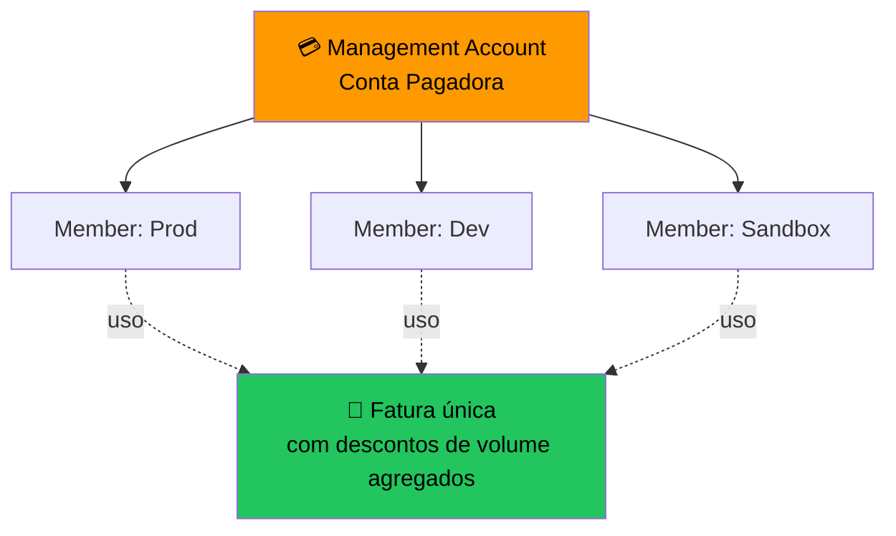

# 4.3 — Consolidated Billing e Organizations

## O Que É?

**Consolidated Billing** é um recurso do **AWS Organizations** que consolida o faturamento de várias contas AWS em **uma única fatura**.

---

## Benefícios

1. **Uma fatura** para a organização inteira.
2. **Preços por volume agregado** — maior volume = menor preço (ex.: S3, transferência).
3. **Compartilhamento de Reserved Instances e Savings Plans** entre contas.
4. **Rastreamento de custos por conta** mantido.
5. **Gratuito**.

---

## Funcionamento

- **Management account** paga por todas.
- **Member accounts** recebem apenas o detalhamento.
- Uso de RIs/SP pode ser **compartilhado** (se habilitado).

---

## Limites e detalhes

- Uma conta pode pertencer a **apenas uma organização**.
- Cota inicial pequena de contas — solicitar aumento via *Service Quotas* se precisar.
- Compartilhamento de RI/SP pode ser **desabilitado por conta** se desejado.

---

## AWS Organizations — além do billing

Consolidated Billing é só uma das funções. O Organizations também oferece:

### Feature Sets
- **All features** *(padrão)* — habilita SCPs, gerenciamento centralizado completo.
- **Consolidated billing only** *(legado)* — apenas faturamento, sem controles.

### OUs (Organizational Units)
- Agrupam contas em **hierarquia** (ex.: `Prod`, `Dev`, `Sandbox`, `Security`).
- SCPs e políticas podem ser aplicadas a OUs inteiras.

### SCPs (Service Control Policies)
- **Guardrails** que definem o **máximo de permissões** para contas/OUs.
- ⚠ **Não concedem permissão** — apenas **restringem**. A permissão efetiva é a interseção entre IAM e SCP.
- Exemplo: bloquear uso de regiões fora de `sa-east-1` em todas as contas de Dev.
- **Não se aplicam à management account.**

### Criação de contas
- Novas contas podem ser criadas **via API/Console** dentro da org — gratuito.

### Sair da organização
- Uma member account só consegue sair se tiver **informações de pagamento e contato próprias** (precisa estar apta a se manter standalone).

---

## AWS Control Tower

- **Landing zone** pronta sobre o Organizations.
- Provisiona ambiente multi-conta com **guardrails** (preventivos via SCP + detectivos via Config) e dashboard centralizado.
- Use quando quiser uma estrutura multi-conta **opinada e automatizada**.

---

## Pontos-Chave para o Exame

- ✅ Consolidated Billing é recurso do **Organizations**.
- ✅ **Uma fatura**, **descontos por volume agregado**.
- ✅ RIs/SP podem ser **compartilhadas** entre contas.
- ✅ Totalmente **gratuito**.
- ✅ **SCPs** = guardrails que **restringem** (não concedem) permissões; não se aplicam à management account.
- ✅ **OUs** organizam contas em hierarquia para aplicar SCPs/políticas.
- ✅ **Control Tower** = landing zone multi-conta pronta sobre o Organizations.
- ✅ Feature sets: **All features** (com SCPs) vs **Consolidated billing only** (legado).

## Documentação Oficial (pt-BR)

- [Consolidated Billing](https://docs.aws.amazon.com/pt_br/awsaccountbilling/latest/aboutv2/consolidated-billing.html)
- [AWS Organizations](https://docs.aws.amazon.com/pt_br/organizations/latest/userguide/orgs_introduction.html)
- [Volume discounts no Consolidated Billing](https://docs.aws.amazon.com/pt_br/awsaccountbilling/latest/aboutv2/useconsolidatedbilling-effective.html)

---

[← Aula anterior](./4.2-ferramentas-faturamento.md) | [Próxima aula → 4.4 Planos de Suporte](./4.4-planos-de-suporte.md)
