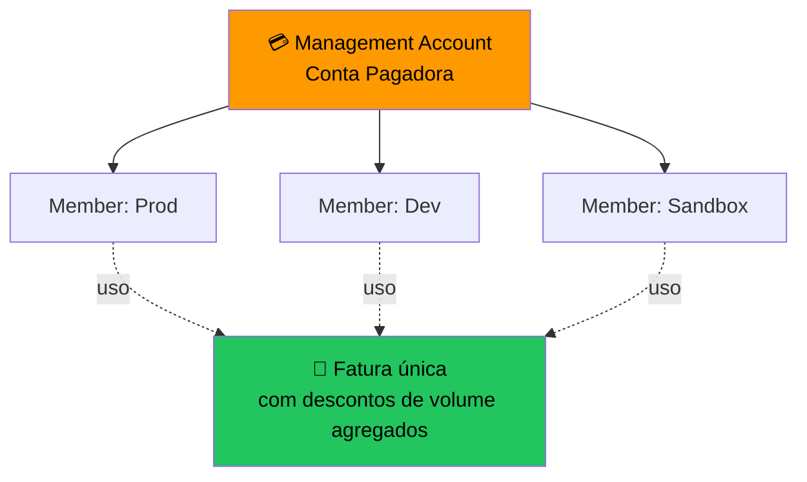

# 4.3 — Consolidated Billing e Organizations

## O Que É?

**Consolidated Billing** é um recurso do **AWS Organizations** que consolida o faturamento de várias contas AWS em **uma única fatura**.

---

## Benefícios

1. **Uma fatura** para a organização inteira.
2. **Preços por volume agregado** — maior volume = menor preço (ex.: S3, transferência).
3. **Compartilhamento de Reserved Instances e Savings Plans** entre contas.
4. **Rastreamento de custos por conta** mantido.
5. **Gratuito**.

---

## Funcionamento

- **Management account** paga por todas.
- **Member accounts** recebem apenas o detalhamento.
- Uso de RIs/SP pode ser **compartilhado** (se habilitado).

---

## Limites

- Uma conta pode pertencer a **apenas uma organização**.
- Até **10 contas** sem aprovação AWS (solicitar aumento se precisar mais).

---

## Pontos-Chave para o Exame

- ✅ Consolidated Billing é recurso do **Organizations**.
- ✅ **Uma fatura**, **descontos por volume agregado**.
- ✅ RIs/SP podem ser **compartilhadas** entre contas.
- ✅ Totalmente **gratuito**.

---

[← Aula anterior](./4.2-ferramentas-faturamento.md) | [Próxima aula → 4.4 Planos de Suporte](./4.4-planos-de-suporte.md)
